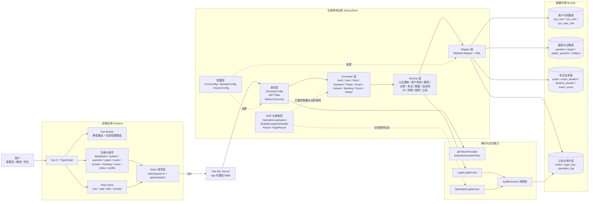

# 在线考试系统架构图

## 总体说明

该项目是一个前后端分离的在线考试系统：

- 前端位于 `frontend/`，基于 Vue 3、TypeScript、Pinia、Vue Router、Element Plus、Axios。
- 后端位于 `src/main/java/com/exam/`，基于 Spring Boot、Spring Security、JWT、MyBatis、MySQL。
- 开发环境下，前端通过 Vite 代理将 `/api` 请求转发到 `http://localhost:8080`。
- 后端采用典型单体分层架构：`Controller -> Service -> Mapper -> MySQL`，并通过 JWT、安全过滤器、AOP 日志、全局异常处理做横切治理。

## Mermaid 架构图

## 架构解读

- 前端负责页面渲染、权限路由控制、状态管理和接口调用，登录后通过 JWT 携带身份信息访问后端。
- 后端安全链路由 Spring Security 和 JWT 过滤器负责，请求通过鉴权后进入各业务 Controller。
- 业务核心集中在 Service 层，其中答题、自动判分、人工阅卷、成绩统计是考试主流程的核心。
- 数据访问由 MyBatis `Mapper + XML` 完成，底层统一落到 MySQL。
- 登录日志和操作日志采用异步线程池写库，避免影响主业务请求时延。
